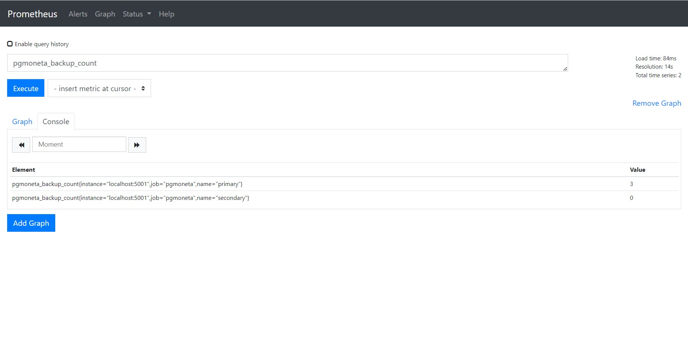
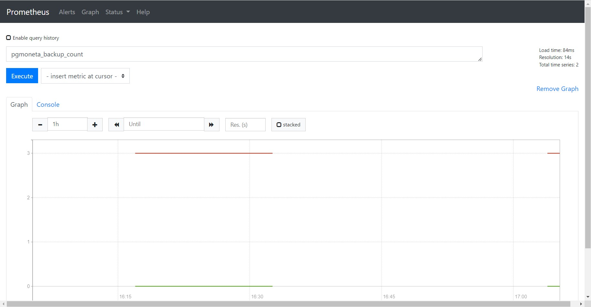
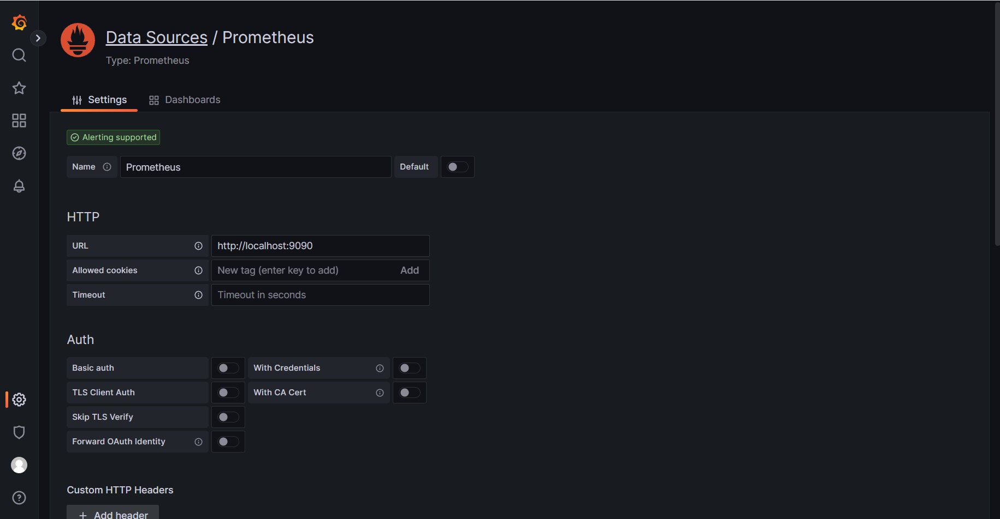
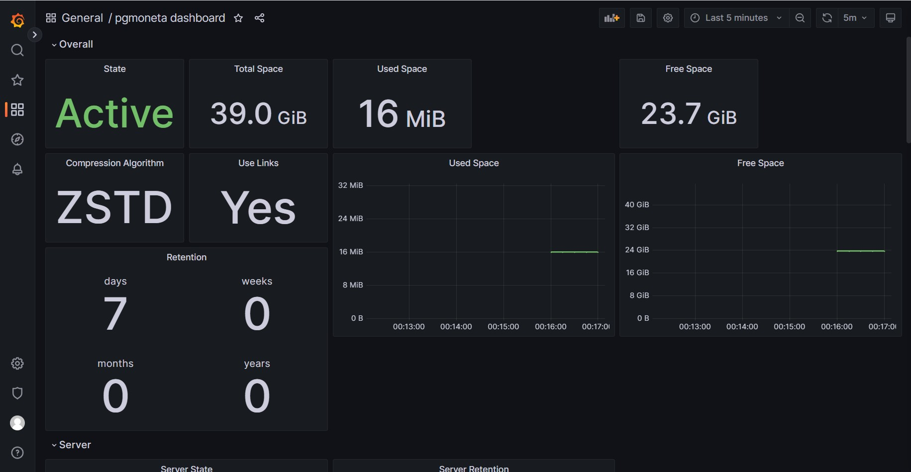

## Grafana Dashboard

This tutorial will show you how to encapsulate Prometheus standard API and use them to monitor state of [**pgmoneta**](https://github.com/pgmoneta/pgmoneta) with the help of Grafana dashboard.

### Preface

This tutorial assumes that you have an installation of PostgreSQL 13+ and [**pgmoneta**](https://github.com/pgmoneta/pgmoneta).

See [Install pgmoneta](https://github.com/pgmoneta/pgmoneta/blob/main/doc/tutorial/01_install.md)
for more detail.

### Prometheus Configuration

First of all, you should install Prometheus in your [**pgmoneta**](https://github.com/pgmoneta/pgmoneta) server.

After you successfully installed Prometheus, you should replace `prometheus.yml ` with the content below to configure how to query your [**pgmoneta**](https://github.com/pgmoneta/pgmoneta) metrics.

```yml
scrape_configs:
  - job_name: 'pgmoneta'
    metrics_path: '/metrics'
    static_configs:
      - targets: ['localhost:5001']
```

Then the Prometheus service will query your [**pgmoneta**](https://github.com/pgmoneta/pgmoneta) metrics every 15 seconds and package them as time-series data. You can query your [**pgmoneta**](https://github.com/pgmoneta/pgmoneta) metrics and watch their changes as time passed in Prometheus web page (default port is `9090`).





### Grafana Dashboard Import

Although Prometheus provides capacity of querying and monitoring metrics, we can not customize graphs for each metric and provide a unified view.

As a result, we use Grafana to help us manage all graphs together. First of all, we should install Grafana in the computer you need to monitor [**pgmoneta**](https://github.com/pgmoneta/pgmoneta) metrics. You can browse Grafana web page with default port `3000`, default user `admin` and default password `admin`. Then you can create Prometheus data source of [**pgmoneta**](https://github.com/pgmoneta/pgmoneta).



Finally you can create dashboard by importing `contrib/grafana/dashboard.json` and monitor metrics about [**pgmoneta**](https://github.com/pgmoneta/pgmoneta).


